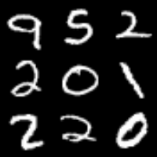
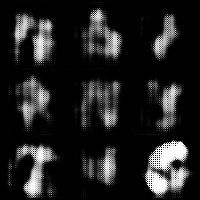
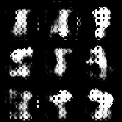

# Basics neural network course home tasks

### Project structure

```
basics_NN_course_ht/
├── data/                       <- Project data
├── src/                        <- Project source code
│ ├── data/                     <- Source code for data processing
│ ├── models/                   <- Source code for models
│ ├── train/                    <- Source code for train loops
│ ├── __main__.py               <- Init train file
│ ├── logs_to_gif.py            <- Wandb logs to gif files
│ └── utils.py                  <- Config and paths
├── images/                     <- gifs and images for readme
├── train_rnn.py                <- script for RNN, GRU and LSTM training
├── Steel_industry_data.csv     <- data for RNN, GRU and LSTM training
├── README.md
└── requirements.txt
```

### First task: VAE+GAN

##### Develop a bundle of VAE and GAN to recover numbers from the MNIST dataset. In this case, VAE and GAN are not separate neural networks, but form a single pipeline with a triplex loss function

<p align="center">
    <figure style="display: inline-block; margin: 0 10px; text-align: center">
        
        <figcaption style="font-weight: bold; font-size: 16px">Real images</figcaption>
    </figure>
    <figure style="display: inline-block; margin: 0 10px; text-align: center">
        
        <figcaption style="font-weight: bold; font-size: 16px">Reconstructed images</figcaption>
    </figure>
    <figure style="display: inline-block; margin: 0 10px; text-align: center">
        
        <figcaption style="font-weight: bold; font-size: 16px">Generated images</figcaption>
    </figure>
</p>


### Second task: RNN

Develop RNN, GRU and LSTM to predict Usage_kWh. Dataset - http://archive.ics.uci.edu/dataset/851/steel+industry+energy+consumption.

Hyperparameters are at your discretion

Compare the quality of the MSE, RMSE and R^2 models
